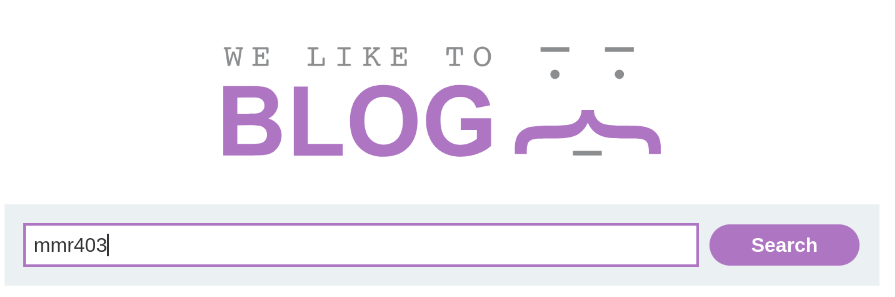
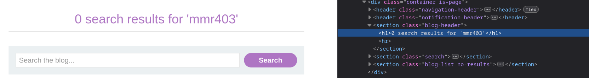
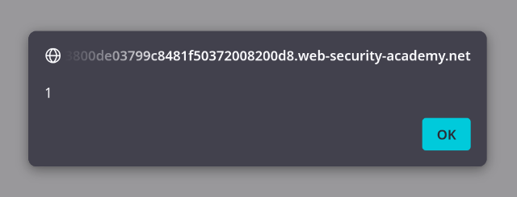

## Key points:
1. this is a reflected xss
2. the vulnerability is in search functionality
3. user input get reflected directly inside DOM 
## What I need to do:
- find the xss vulnerability in the search
- craft a payload to call alert() function
## How I solved it:

1. passed the string `duckky` in the search
2. noticed in the url search parameter `?search=duckky` reflected into the `h1` tag in DOM
3. passed the string `` and it returned the alert box proving xss vulnerability
## Why this works:

In this lab the website directly copies the search parameter and puts it inside `h1` tag. There is no encoding of the angle braces(`< >`) or forward slash(`/`). for this reason after the response the `h1` tag looks like this `<h1></h1>` which executes the JavaScript code.

## Payload:
``