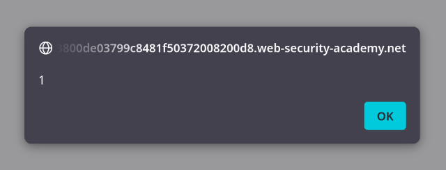

## Key points:
1. this is a stored xss
2. the vulnerability is in user's comment
3. user's comment injects xss payload inside DOM
## What I need to do:
- find the stored cross-site scripting vulnerability in the comment functionality
- craft a payload to call alert() function
## How I solved it:

1. First I passed a dummy string "mmr403" in the comment which is 
2. noticed in the comment reflected into the `p` tag in DOM
3. Input the playload `` and it returned the alert box proving xss vulnerability
## Why this works:

In this lab the website directly pass the comment and puts it inside `p` tag. There is no encoding of the angle braces(`< >`) or forward slash(`/`). for this reason after the response the `p` tag looks like this `

` which executes the JavaScript code. The comment stays saved in the database and whenerver the page opens it loads the payload and executes it.

## Payload:
``